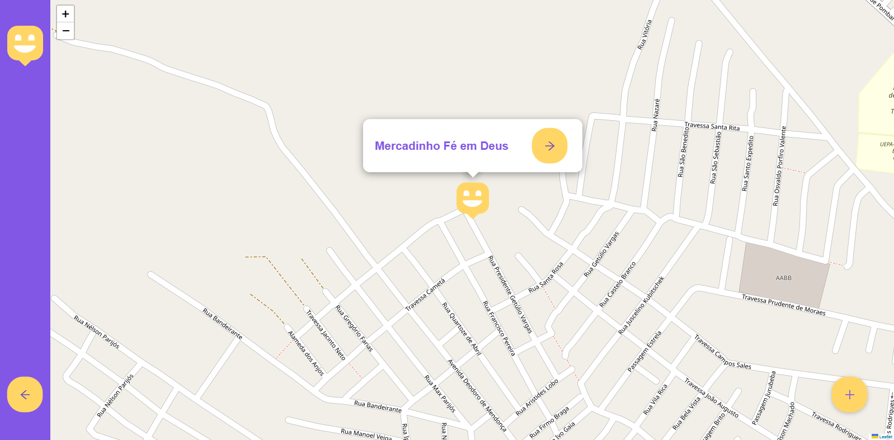
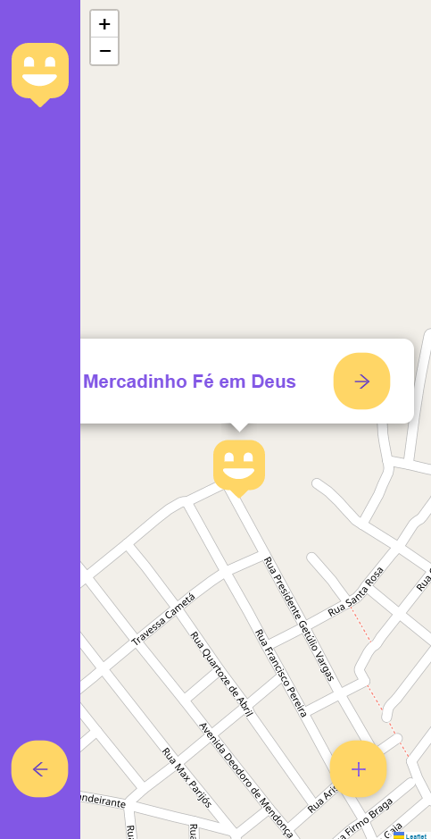
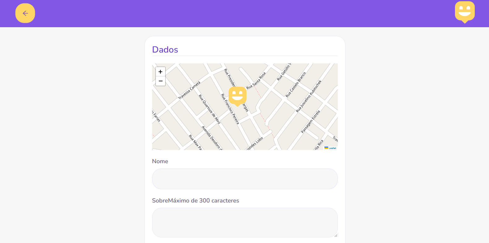
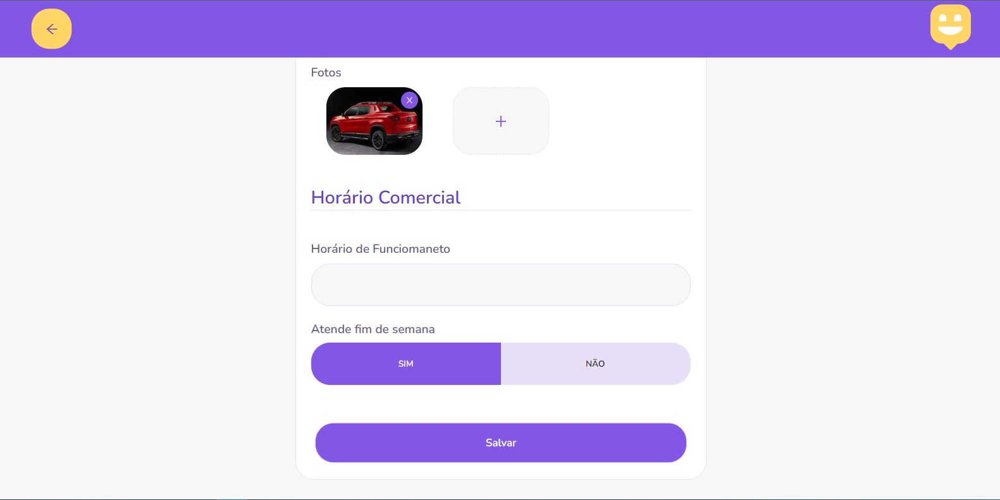
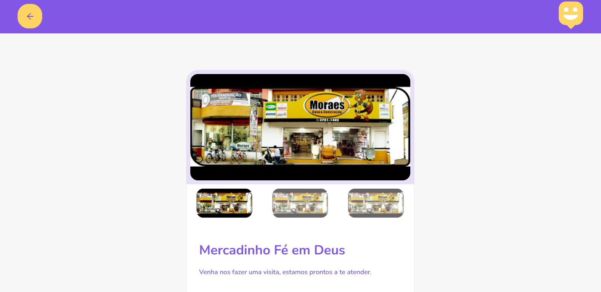
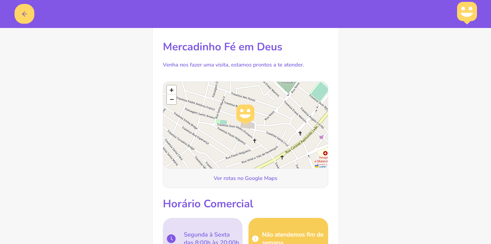
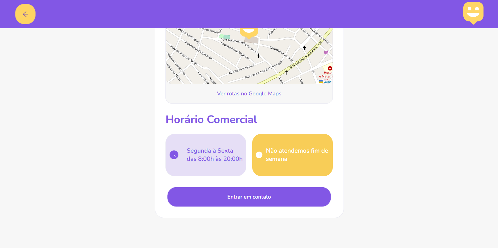

## 💻 Projeto City Commerce

---

Desenvolvimento de uma aplicação frontend com ReactJS, para o cadastro de pontos comerciais do Baixo-Tocantins, todo o layout é responsivo para tablet e smartphone. Iremos utilizar Typescript, SCSS, axios, ReactRouterDom e ReactIcons.

<h3 align="center">
  Landing Page
</h3>

<p align="center">
  
  
</p>

<h3 align="center">
  Shops Map
</h3>

<p align="center">
  
  
</p>

<h3 align="center">
  New Shop
</h3>

<p align="center">
  
  
</p>

<h3 align="center">
  Details
</h3>

<p align="center">
  
  
  
</p>

## :rocket: Tecnologias Utilizadas
---

-  [Typescript](https://www.typescriptlang.org/)
-  [ReactJS](https://reactjs.org/)
-  [axios](https://github.com/axios/axios)
-  [ReactRouterDom](https://www.npmjs.com/package/react-router-dom)
-  [ReactIcons](https://www.npmjs.com/package/react-icons)
-  [ReactLeaflet](https://react-leaflet.js.org/)
-  [GoogleFonts](https://fonts.google.com/)

## 🔖 Configurações do Layout WEB

---
```cl
  💻 Comando para criar o projeto
  - ✨ yarn create react-app city-commerce --template typescript

  🛠️ Comando para executar o projeto
  - ✨ yarn start

  🛠️ Biblioteca para realizar pré processamento de css
  - ✨ yarn add sass

  🛠️ Biblioteca para node reconhecer o sass
  - ✨ yarn add node-sass

  🛠️ Biblioteca para navegação de rotas
  - ✨ yarn add react-router-dom

  🛠️ Biblioteca para utilizar ícones
  - ✨ yarn add react-icons

  🛠️ Biblioteca para requisição de api
  - ✨ yarn add axios

  🛠️ Biblioteca para trabalhar com mapas
  - ✨ yarn add leaflet react-leaflet
  - ✨ yarn add @types/leaflet -D
```

## :arrow_forward: Como Executar

---

```bash
# clonar o repositório


# entrar na pasta city-commerce
cd commerce

# instalação das dependências
yarn install

# executar o projeto
yarn start
```
## :man_student: Autores
---

Feito com ♥ by Laciene Melo, Miguel Ângelo, Leonardo Gonçalves:wave: [#lacymelo](https://github.com/lacymelo) [#angelomocbel](https://github.com/angelomocbel) [#gnleo](https://github.com/lacymelo)